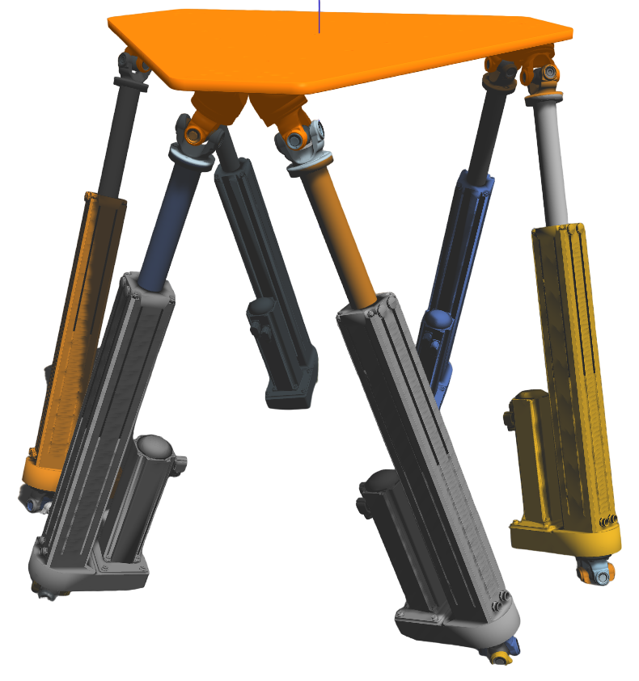

# Hexapode

Assistant engineer internship project

Automatic landing of a drone by visual servoing

Part covered : Modeling and simulation of the behavior of a naval platform in ROS (Robot Operating System)

## Description

* Author: Maelys Lupin <maelyslupin6@gmail.com>

## Onshape model

https://cad.onshape.com/documents/de1d9110a18bcb6a5b05430c/w/f5675b9c25413e05b1b40ebe/e/34884ef48ea0a4a7a218ee9c?renderMode=0&uiState=6384c4c8483c5c5197956ed7

## Installation 

ROS noetic : http://wiki.ros.org/noetic/Installation/Ubuntu

effort_controllers/JointPositionController : sudo apt-get install ros-version_ros-effort_controllers

## Full sim

1. roslaunch rrbot_gazebo rrbot_world.launch

2. roslaunch rrbot_control rrbot_control.launch

3. rosrun rrbot_control mobile.py

## Startup

Rviz:

    roslaunch rrbot_description rrbot_rviz.launch

Gazebo:

    roslaunch rrbot_gazebo rrbot_world.launch

ROS Control:

    roslaunch rrbot_control rrbot_control.launch

Example of Moving Joints:

    rostopic pub /rrbot/verin_joint1_position_controller/command std_msgs/Float64 "data: -0.3"

Get the values:

    rostopic echo rrbot/joint_states
    
### Automating

Start interface:

    rosrun rrbot_control mobile.py
or  

    rosrun rrbot_control fixe.py
    

